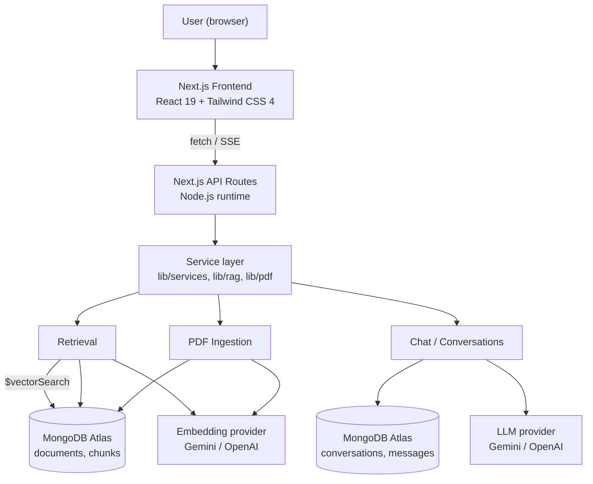
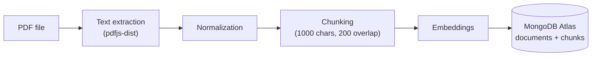
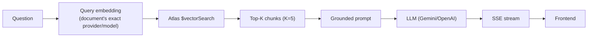
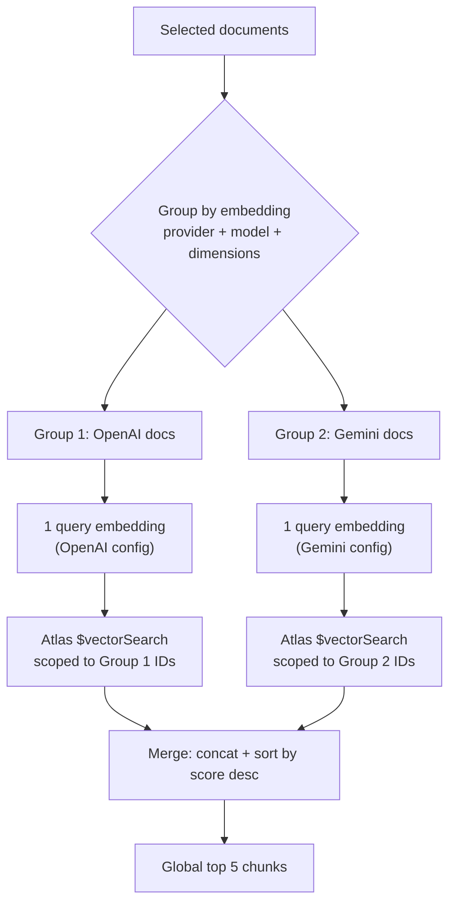

# DocChat

DocChat is a full-stack RAG (Retrieval-Augmented Generation) application: upload one or more PDF
documents, and ask natural-language questions about their content. Answers are streamed and
strictly grounded in the retrieved excerpts — the model is instructed, and the application is
coded, to say so explicitly rather than guess when an answer isn't supported by the document(s).

Built for the **Senior Full Stack Engineer — AI / LLM** technical test ("DocChat — Posez des
questions à vos PDF").

## Demo

- **Live app:** https://docchat-taupe.vercel.app
- **Repository:** https://github.com/IBRINGO/docchat

## Features

Maps directly to the test's expected user flow:

1. Open the public Vercel URL — no login required (see [Security](#security)).
2. Upload one or more PDFs (drag-and-drop or browse), with real per-file upload progress.
3. Only native-text PDFs are supported — no OCR (scanned/image-only PDFs are rejected with a
   clear error at ingestion).
4. Per-document limit enforced: **10 MB**, **50 pages**.
5–6. Text is extracted (`pdfjs-dist`) and split into overlapping chunks.
7–8. Chunks are embedded via an external embedding API (Gemini or OpenAI) and persisted to
   MongoDB Atlas alongside the source document metadata.
9. The user asks questions about one or more selected, ready documents.
10. The backend runs an Atlas **`$vectorSearch`** query to retrieve the most relevant chunks.
11–12. A grounded prompt is built from those chunks and sent to an LLM (Gemini or OpenAI), which
   answers using only that context.
13. If retrieval finds nothing relevant, the app returns a deterministic "not found in the
   document" answer **without calling the LLM at all** — this is enforced in code, not left to the
   model's discretion.
14. The answer streams to the frontend via Server-Sent Events, rendered progressively as Markdown.
15. Each answer shows its source chunks — document name, page, and a relevance percentage/label
   derived from the vector similarity score — with an expandable full-text preview per source.

Beyond the base flow, the app also persists **conversations**: multiple questions in a thread,
conversation history in a sidebar, restoring a past conversation's exact messages and document
context, and deleting a conversation.

## Architecture



Every server-only dependency (`mongodb`, `openai`, `@google/genai`, `pdfjs-dist`,
`lib/config/env.ts`, every `lib/services/*` / `lib/providers/*` module) is only ever imported from
API routes — no client component or hook reaches a server-only module, so API keys and database
credentials never enter the browser bundle.

## RAG Pipeline

**Ingestion** (`POST /api/upload` → `DocumentIngestionService`):



Every step (extraction, chunking, embedding, cross-check) runs **in memory first**; a document is
only written to MongoDB once the entire pipeline has already succeeded, so a bad PDF or a provider
outage never leaves a document stuck half-processed. Chunking (`lib/rag/chunker.ts`) is a
deterministic, hierarchical splitter: it prefers paragraph breaks, then sentence boundaries, then
whitespace, and only hard-cuts as a last resort — chunk size **1000** characters, overlap **200**.

**Query** (`POST /api/chat` → `RetrievalService` → `ChatService`):



If zero chunks come back, the LLM is never called — the app streams a deterministic "not found"
answer (in English or French, detected from the question — see
[Bonus Features](#bonus-features)) as a single event.

## Multi-Document Retrieval

Selecting several documents doesn't just loop retrieval per document — vectors from different
embedding providers/models are **never comparable, even at equal dimensions**, so documents are
first grouped by their exact stored `(embeddingProvider, embeddingModel, embeddingDimensions)`:



One query embedding and one Atlas query **per distinct configuration present in the request**, not
per document — five documents sharing one configuration still cost exactly one of each. Each
group's own top-5 results (Atlas's `vectorSearchScore`) are concatenated, sorted by score
descending, and sliced to a global top-5 — no per-group rescaling, since Atlas already normalizes
`vectorSearchScore` to 0–1 for cosine similarity. Every requested document ID is re-validated
server-side regardless (valid ObjectId, exists, `status: "ready"`, and the combined selection
respects the cumulative 10 MB / 50-page limits) — the frontend's own selection UI is never trusted
as the sole authority.

## Conversations

Two additional MongoDB collections, `conversations` and `messages`, back persistent chat history:

```ts
Conversation { _id, title, documentIds: ObjectId[], createdAt, updatedAt }
Message { _id, conversationId, role: "user" | "assistant", content, sources: SourceReference[], createdAt }
```

- **A conversation's document set is fixed at creation.** Continuing an existing conversation
  requires the request's `documentIds` to match the stored set exactly (order-independent) —
  otherwise the request is rejected with `409 CONVERSATION_DOCUMENT_CONTEXT_MISMATCH`. Changing
  documents always means starting a new conversation.
- **Streaming-safe persistence:** the user's message is persisted *before* the SSE stream starts
  (so a request that fails validation never leaves an orphaned conversation); the assistant's
  message is persisted *only after* generation completes successfully — a failed or
  mid-stream-interrupted answer is never saved as if complete.
- **Titles** are derived deterministically from the first user message (truncated, no LLM call).
  Uploading document(s) creates a conversation before any message exists, using the placeholder
  title `"New conversation"`; that placeholder is atomically replaced the moment a first message
  actually arrives.
- The frontend shows exactly one of two modes at a time, derived purely from whether a real
  `conversationId` is loaded (never from title): a **document workspace** (upload, library,
  selection) or a focused **active conversation** view. "New Conversation" clears only client-side
  state — no conversation is ever deleted by it.

## PDF Ingestion

- PDF only, verified by extension, MIME type, *and* the `%PDF-` magic-byte signature (not just a
  trusted `Content-Type` header).
- **10 MB** max file size, **50 pages** max — enforced server-side (`lib/validation/upload.schema.ts`,
  `lib/config/document-limits.ts`), independent of any client-side check.
- Text-only extraction via `pdfjs-dist` (no OCR); a scanned/image-only PDF fails with
  `PDF_TEXT_NOT_EXTRACTABLE`.
- On Vercel's Linux serverless runtime, `pdfjs-dist`'s Node build previously crashed at import time
  with `ReferenceError: DOMMatrix is not defined` — see
  [Technical Decisions & Trade-offs](#technical-decisions--trade-offs) for the root cause and fix.

## Document Library & Upload UX

- **Multi-file upload queue** (`hooks/useMultiDocumentUpload.ts`): any number of files, uploaded
  sequentially (not unlimited-parallel), each with a real, honestly-derived status — `queued →
  uploading (genuine XHR progress %) → processing → ready | failed`. A failed file stays visible
  with its reason; it's never silently dropped, and a failed upload can be retried individually.
- **Upload → conversation:** once every file in one upload action has settled, the
  successfully-uploaded ("ready") documents become the active selection and get **one** new
  persisted conversation — never one conversation per file, and none at all if every file failed.
- **Document library** (`GET /api/documents`): filename search, status filtering
  (processing/ready/failed), pagination.
- **Multi-document selection** with a live running total (size/pages) against the cumulative
  limits, and clear feedback when a selection would exceed them.
- **Chat UI:** Markdown-rendered streamed answers (`react-markdown` + `remark-gfm`, no raw HTML
  execution), source cards with a relevance label/percentage and an expandable full-chunk preview,
  a copy-answer action, and restrained transitions that respect `prefers-reduced-motion`.

## Tech Stack

| Layer | Choice |
| --- | --- |
| Frontend | Next.js 16 App Router, React 19, TypeScript (strict), Tailwind CSS 4 |
| Backend | Next.js API Routes, Node.js runtime (`export const runtime = "nodejs"`) |
| Database | MongoDB Atlas — `documents`, `chunks`, `conversations`, `messages` collections + Atlas Vector Search |
| Embeddings | Gemini `gemini-embedding-2` (primary) / OpenAI `text-embedding-3-small` (fallback) |
| Answer generation | Gemini `gemini-3.6-flash` (primary) / OpenAI `gpt-4o-mini` (fallback) |
| PDF parsing | `pdfjs-dist` (legacy Node build), text extraction only |
| Markdown rendering | `react-markdown` + `remark-gfm` |
| Validation | `zod` |
| Testing | `vitest` |
| Deployment | Vercel |

No LangChain/LlamaIndex — justified in
[Technical Decisions & Trade-offs](#technical-decisions--trade-offs).

## Database Design

| Collection | Purpose | Key fields |
| --- | --- | --- |
| `documents` | One record per uploaded PDF | `status` (`processing`\|`ready`\|`failed`), `pageCount`, `chunkCount`, `embeddingProvider`/`embeddingModel`/`embeddingDimensions`, `errorCode`/`errorMessage` |
| `chunks` | One record per text chunk | `documentId` (references `documents._id`), `content`, `pageNumber`, `chunkIndex`, `embedding: number[]`, and its own copy of `embeddingProvider`/`embeddingModel`/`embeddingDimensions` (so a chunk's vector space is self-describing, not just inherited) |
| `conversations` | One record per chat thread | `title`, `documentIds: ObjectId[]` (fixed at creation), `updatedAt` (bumped on every message) |
| `messages` | One record per chat turn | `conversationId` (references `conversations._id`), `role`, `content`, `sources: SourceReference[]` (a denormalized snapshot — document name, chunk content, page, score at the time of the answer — so history still renders correctly even if a source document is later re-ingested or deleted) |

### Normal (non-vector) indexes

Created by `initializeDatabaseIndexes()` (`lib/db/indexes.ts`) — idempotent, run manually via
`npm run db:indexes`, never automatically:

```
documents:      { createdAt: -1 }                       — document library, newest first
documents:      { status: 1 }                            — status filtering
chunks:         { documentId: 1 }                         — delete/lookup all chunks of a document
chunks:         { documentId: 1, chunkIndex: 1 } (unique) — ordered/unique chunk lookup
chunks:         { documentId: 1, pageNumber: 1 }          — per-page chunk lookup
conversations:  { updatedAt: -1 }                          — conversation list, newest activity first
messages:       { conversationId: 1, createdAt: 1 }       — ordered message history per conversation
```

## Vector Search Index

**Not created by application code** — configured manually in the Atlas UI/CLI. Name is
configurable via `MONGODB_VECTOR_INDEX` (default `chunks_vector_index`):

```json
{
  "name": "chunks_vector_index",
  "type": "vectorSearch",
  "definition": {
    "fields": [
      { "type": "vector", "path": "embedding", "numDimensions": 1536, "similarity": "cosine" },
      { "type": "filter", "path": "documentId" },
      { "type": "filter", "path": "embeddingProvider" },
      { "type": "filter", "path": "embeddingModel" }
    ]
  }
}
```

The three `filter` fields are required, not optional: they're what keeps one query scoped to a
specific set of document IDs *and* one embedding space, preventing cross-document or
cross-provider vector contamination. `numDimensions: 1536` matches this project's actual embedding
models (both `text-embedding-3-small` and `gemini-embedding-2` are used at 1536 dimensions here);
if a different model/dimension were ever used, the index would need to match it. If the index is
missing, misconfigured, or the query fails for any reason, `POST /api/chat` returns a structured
`502 VECTOR_SEARCH_FAILED` — raw MongoDB/Atlas error detail is logged server-side only.

## API

All routes are under `app/api/`, declare `export const runtime = "nodejs"`, and return
`{success: true, ...}` or `{success: false, error: {code, message}}` (never a raw stack trace or
provider error).

| Endpoint | Method | Purpose |
| --- | --- | --- |
| `/api/upload` | `POST` | Upload and ingest one PDF |
| `/api/chat` | `POST` | Ask a question (SSE streamed answer) |
| `/api/documents` | `GET` | List/search/filter uploaded documents |
| `/api/conversations` | `GET` | List conversations |
| `/api/conversations` | `POST` | Explicitly create a conversation (no message yet) |
| `/api/conversations/:id` | `GET` | Load one conversation + its messages |
| `/api/conversations/:id` | `DELETE` | Delete a conversation and its messages |

### `POST /api/upload`

`multipart/form-data`, field `file`. Validates MIME type, extension, size (≤10 MB), and the PDF
magic-byte signature; rejects a document over 50 pages after extraction.

```json
// 200
{ "success": true, "document": {
  "id": "...", "fileName": "report.pdf", "status": "ready",
  "pageCount": 3, "chunkCount": 12,
  "embeddingConfiguration": { "provider": "gemini", "model": "gemini-embedding-2", "dimensions": 1536 }
}}
```

Errors: `400 FILE_MISSING`, `415 INVALID_FILE_TYPE`, `413 FILE_TOO_LARGE`,
`422 INVALID_PDF_FILE` / `PDF_INVALID_INPUT` / `PDF_UNREADABLE` / `PDF_TEXT_NOT_EXTRACTABLE` /
`PDF_TOO_MANY_PAGES`, `500 DOCUMENT_INGESTION_FAILED`, and embedding-provider errors
(`AI_PROVIDER_NOT_CONFIGURED`, `EMBEDDING_GENERATION_FAILED`, etc.) if no key is configured or the
provider fails.

### `POST /api/chat`

```json
{ "documentIds": ["<id>", "..."], "message": "What are the objectives?", "conversationId": "optional" }
```

Rate-limited (10 req/60s per client, best-effort, see [Known Limitations](#known-limitations)).
Validation/document/conversation failures return an ordinary JSON error *before* the SSE stream
starts, with the matching status: `400 INVALID_CHAT_REQUEST` / `INVALID_DOCUMENT_ID` /
`DOCUMENT_SELECTION_LIMIT_EXCEEDED`, `404 DOCUMENT_NOT_FOUND` / `CONVERSATION_NOT_FOUND`,
`409 DOCUMENT_NOT_READY` / `CONVERSATION_DOCUMENT_CONTEXT_MISMATCH`, `503 AI_PROVIDER_NOT_CONFIGURED`,
`502 VECTOR_SEARCH_FAILED`, `429 RATE_LIMITED`.

Once streaming starts, the response is `Content-Type: text/event-stream`:

```
event: metadata
data: {"conversationId":"...","documentIds":["..."],"sources":[{"id":"...","documentId":"...","documentName":"...","content":"...","pageNumber":1,"chunkIndex":0,"score":0.91}]}

event: delta
data: {"text":"partial answer..."}

event: done
data: {}
```

or, if generation fails mid-stream: `event: error` / `{"code":"LLM_GENERATION_FAILED","message":"..."}`.

### `GET /api/documents`

`?q=<search>&status=processing|ready|failed&page=1&limit=20` (limit capped at 100). Response never
includes embeddings or chunk content — just what a document picker needs.

### `GET /api/conversations`

`?page=1&limit=20`, sorted by `updatedAt` descending; each summary includes resolved
`documentNames` (one batched lookup per page, not one query per conversation).

### `POST /api/conversations`

```json
{ "documentIds": ["<id>", "..."] }
```

Creates a conversation with no messages and title `"New conversation"`. Documents are re-validated
exactly like `/api/chat` (existence, `ready` status, cumulative limits). `201`:

```json
{ "success": true, "conversation": { "id": "...", "title": "New conversation", "documentIds": ["..."], "createdAt": "...", "updatedAt": "..." } }
```

Errors: `400 INVALID_CREATE_CONVERSATION_REQUEST` / `INVALID_DOCUMENT_ID` /
`DOCUMENT_SELECTION_LIMIT_EXCEEDED`, `404 DOCUMENT_NOT_FOUND`, `409 DOCUMENT_NOT_READY`.

### `GET /api/conversations/:id` / `DELETE /api/conversations/:id`

`GET` returns full conversation metadata plus every message, oldest first, with each assistant
message's `sources`. `DELETE` removes the conversation's messages, then the conversation itself.
Both: `400 INVALID_CONVERSATION_ID`, `404 CONVERSATION_NOT_FOUND`.

`GET /api/conversations*` and `/api/documents` are read/delete-only, so they're not rate-limited as
tightly as `/api/chat` (conversations: 60 req/60s; `/api/documents` currently has no rate limit at
all).

## Environment Variables

Inspected from `lib/config/env.ts` and `.env.example`.

**Required:**

| Variable | Purpose |
| --- | --- |
| `MONGODB_URI` | Atlas connection string |
| `MONGODB_DB_NAME` | Database name |

**At least one required** (both enables automatic fallback):

| Variable | Purpose |
| --- | --- |
| `OPENAI_API_KEY` | OpenAI embeddings/generation (fallback) |
| `GEMINI_API_KEY` | Gemini embeddings/generation (primary) |

**Optional:**

| Variable | Default | Purpose |
| --- | --- | --- |
| `MONGODB_VECTOR_INDEX` | `chunks_vector_index` | Atlas Vector Search index name |
| `MONGODB_VECTOR_NUM_CANDIDATES` | `50` | Atlas candidate pool size per query |

No other environment variables are read anywhere in the codebase. Never commit real values — see
`.env.example` for the placeholder template.

## Local Development

**Prerequisites:** Node.js 20.16.0 (this project intentionally targets that version, not a newer
one), a MongoDB Atlas cluster, and a Gemini and/or OpenAI API key.

```bash
git clone https://github.com/IBRINGO/docchat.git
cd docchat
npm install
cp .env.example .env.local   # fill in real values — never commit .env.local
```

**MongoDB Atlas setup:** create a free/shared cluster, a database user, and allow your IP (or
`0.0.0.0/0` for local testing) in Network Access. Then create the Atlas Vector Search index
manually (Atlas UI → your cluster → Search → Create Search Index → JSON editor) using the
definition under [Vector Search Index](#vector-search-index) above — application code cannot
create this index itself.

Then initialize the normal (non-vector) indexes once:

```bash
npm run db:indexes
```

**Run the dev server:**

```bash
npm run dev        # http://localhost:3000
```

**Verification commands** (all from `package.json`):

```bash
npx tsc --noEmit    # strict TypeScript check
npm test            # vitest run — unit tests
npm run lint         # eslint
npm run build        # production build (Next.js/Turbopack)
npm run start         # run the production build locally
```

## Testing

296 tests across 34 files (`npx vitest run`), all pure unit tests — **no real network, database, or
LLM/embedding API calls**; external collaborators (MongoDB collections, provider SDK clients) are
faked via dependency injection (constructor parameters typed as `Pick<RealType, "methodsActuallyUsed">`),
not `vi.mock`. One file (`tests/prompt.test.ts`) contains only a legacy `it.todo` placeholder —
`buildRagPrompt` itself is actually covered by `tests/prompt-builder.test.ts` — which is why the
suite reports "295 passed, 1 todo" across "33 passed, 1 skipped" files.

Covered areas: PDF text extraction and normalization, chunking (boundary selection, overlap,
Unicode surrogate-pair safety), upload validation, embedding provider clients and
fallback/configuration logic, LLM provider clients and streaming/fallback logic, prompt
construction and grounding rules, vector search query construction, multi-document retrieval
(grouping, per-group embedding, merge/global top-K), chat request validation, the chat
orchestration service (persistence ordering, error handling, no-context behavior), conversation
service (creation, title derivation/retitling, document-context matching, message persistence),
conversation listing/detail/deletion, document listing/selection/validation, the multi-file upload
queue's pure state machine, SSE frame parsing, and relevance/Markdown display helpers.

One integration-style test (`tests/document-ingestion.e2e.test.ts`) exercises the *real*
`extractPdf → normalize → chunk` pipeline end to end against an in-memory synthetic PDF (no
fixture file, no network) — only the embedding provider and MongoDB collections are faked.

**Beyond the automated suite**, prior implementation turns also exercised several endpoints live
against this project's real MongoDB Atlas cluster and real Gemini API during development (uploads,
multi-document chat, conversation CRUD, mismatch rejection) — these were manual, ad hoc
verifications during development, not part of the repeatable `npm test` suite, and are not
re-run automatically.

There is no formal evaluation dataset (question/expected-answer pairs) checked into the repository
— see [Known Limitations](#known-limitations).

## Deployment

Deployed on Vercel at https://docchat-taupe.vercel.app.

- Both `app/api/chat/route.ts` and `app/api/upload/route.ts` (and the other API routes) declare
  `export const runtime = "nodejs"` — required, since the MongoDB driver, OpenAI SDK, and
  `@google/genai` SDK are all Node-only and cannot run on Vercel's Edge runtime.
- Environment variables (`MONGODB_URI`, `MONGODB_DB_NAME`, `GEMINI_API_KEY`/`OPENAI_API_KEY`, and
  optionally `MONGODB_VECTOR_INDEX`/`MONGODB_VECTOR_NUM_CANDIDATES`) must be configured in the
  Vercel project settings — they are not read from any file committed to the repository.
- The Atlas cluster's Network Access list must allow connections from Vercel (either specific
  egress IPs or, most simply for a project at this scale, `0.0.0.0/0`).
- MongoDB connections are cached on `global` (`lib/db/mongodb.ts`) and reused across warm
  serverless invocations.
- Streaming uses only standard Web APIs (`ReadableStream`, `Response`), which Vercel's Node.js
  functions support natively — no special Vercel configuration was needed for SSE itself.
- **Known serverless limitation:** the in-memory rate limiter (see
  [Known Limitations](#known-limitations)) only bounds one warm instance, not the deployment as a
  whole, since each serverless instance keeps its own counters.
- Production PDF uploads initially failed on Vercel with `ReferenceError: DOMMatrix is not
  defined` — root cause and fix are covered in
  [Technical Decisions & Trade-offs](#technical-decisions--trade-offs). That fix was verified via a
  local production build/start and an isolated reproduction of the crash mechanism; it has not yet
  been confirmed against a fresh live Vercel deployment of the current commit.

## Technical Decisions & Trade-offs

- **MongoDB Atlas + Atlas Vector Search**, not a dedicated vector database — the test specification
  requires MongoDB Atlas for persistence, and Atlas Vector Search lets document metadata and
  embeddings live in one system rather than syncing two databases, which is the right trade-off at
  this project's scale.
- **No LangChain/LlamaIndex.** The RAG pipeline is small enough that each stage — extraction,
  chunking, embedding, retrieval, prompt construction, generation — is its own directly-testable
  module. At this scope, a framework would add an abstraction layer without removing real
  complexity, and would make several of this project's actual decisions (the
  embedding-compatibility guarantee between ingestion and retrieval, the "never switch provider
  mid-stream" rule, per-document-configuration grouping) harder to see and unit-test directly. This
  isn't a claim that hand-rolled code is better than LangChain/LlamaIndex in general — only that it
  was the right trade-off for a project this size, where the goal was demonstrating direct control
  over each RAG stage.
- **No lexical re-ranking / hybrid search.** Atlas vector similarity retrieval was sufficient for
  this project's scope. Blending in a keyword/lexical signal is a real, legitimate technique, but
  doing it well means tuning a semantic/lexical weighting scheme against real evaluation data,
  which this project doesn't have — adding it without that would mean guessing at weights with no
  way to validate they're actually better. It's listed as a possible future enhancement, not
  implemented.
- **Chunk size 1000 / overlap 200** — a conventional starting point for prose-heavy documents
  (resumes, reports): large enough that a chunk usually contains a complete thought, small enough
  to keep the retrieved context focused and the prompt bounded, with enough overlap that a
  sentence split across a chunk boundary still appears in full in at least one chunk.
- **`topK = 5`** (per embedding-configuration group *and* as the final global bound) — enough
  supporting excerpts for most single-fact and light-comparison questions without letting the
  prompt grow unbounded as more documents are selected.
- **Embedding configuration is preserved per document** (`embeddingProvider`/`embeddingModel`/
  `embeddingDimensions` stored on both the document and every one of its chunks) because a query
  must be embedded with the *exact* configuration a document's chunks were embedded with — OpenAI
  and Gemini vectors are never comparable, even at equal dimensions, and which provider actually
  succeeded for a given document depends on runtime fallback behavior, not a fixed default.
- **A conversation's document set is fixed at creation** — this avoids ever having to reconcile a
  mid-conversation switch between incompatible document/embedding contexts, and keeps "which
  documents was this conversation grounded in" an unambiguous, permanent fact rather than a moving
  target.
- **SSE (Server-Sent Events), not WebSockets** — the chat interaction is one-directional
  (server → client) per turn, and SSE runs over a plain HTTP response (`ReadableStream`), which
  Vercel's Node.js serverless functions support natively with no extra infrastructure.
- **`/api/upload` (and every other API route) runs on the Node.js runtime, not Edge** — the MongoDB
  driver, OpenAI SDK, `@google/genai` SDK, and `pdfjs-dist` are all Node-only.
- **API keys never reach the client** — every provider SDK client, `lib/config/env.ts`, and every
  `lib/services/*`/`lib/providers/*` module is imported exclusively from API routes; client
  components/hooks only ever call `fetch` against this app's own routes.
- **The `DOMMatrix` / `pdfjs-dist` Vercel fix.** `pdfjs-dist`'s Node build unconditionally evaluates
  canvas-*rendering* module code at import time (a module-top-level `new DOMMatrix()`), even though
  this app only extracts text (`page.getTextContent()`, never `page.render()`). `DOMMatrix` isn't a
  real Node global; `pdfjs-dist` tries to self-polyfill it from its optional native `@napi-rs/canvas`
  dependency, which resolved locally (a Windows binary was installed) but not on Vercel's Linux
  serverless runtime — so the self-polyfill silently failed there and the later `new DOMMatrix()`
  threw, crashing the module before the upload handler ever ran. The fix
  (`lib/pdf/node-polyfills.ts`, imported first in `lib/pdf/extract.ts`) defines `globalThis.DOMMatrix`
  from `@thednp/dommatrix` — a small, dependency-free, pure-JS, DOMMatrix-API-compatible class,
  not a native binary, so it behaves identically on every platform. It doesn't implement every
  method of the real browser `DOMMatrix` (e.g. `invertSelf`), which is fine because this app never
  calls into `pdfjs-dist`'s actual rendering functions — only real PDF-to-image rendering (not
  currently a feature of this app) would ever need more than that.

## Bonus Features

**Implemented:**

- Multi-document RAG (selection, per-configuration grouping, merged/ranked retrieval, multi-document
  grounded prompts).
- Persistent conversation history (create/list/open/delete, fixed document context, streaming-safe
  persistence).
- Rate limiting on `/api/chat` and `/api/conversations*` (best-effort, in-memory — see
  [Known Limitations](#known-limitations)).
- Structured logging — every log line is a single JSON object (`level`, `event`, `timestamp`,
  `context`) via `lib/utils/logger.ts`, used consistently across ingestion, retrieval, chat, and
  error paths.
- 296 automated unit tests (see [Testing](#testing)).
- Multi-file upload with a real progress/status queue.
- Document library with search, status filtering, and pagination.
- French support: the grounding prompt explicitly instructs the model to reply in the same
  language as the question, and the deterministic "not found in the document" fallback answer has
  a real French variant, selected by a French-language heuristic (`lib/rag/prompt.ts`) — this has
  been exercised with real French questions against real French documents during development.

**Not implemented / not verified — stated honestly rather than assumed:**

- **Arabic support is not specifically implemented or verified.** The chunker's sentence-boundary
  regex does include the Arabic question mark (`؟`) as a boundary character alongside Latin
  punctuation, so chunking is not Latin-only by accident — but there is no Arabic-specific
  no-context fallback answer, no RTL-specific UI handling, and no verification that
  `pdfjs-dist`'s text extraction or the LLM's Arabic responses behave correctly against a real
  Arabic PDF. Any Arabic support that exists is incidental to the underlying LLM's own
  multilingual capability, not a feature this project specifically built or tested.
- **Lexical re-ranking / hybrid search** — deliberately not implemented (see
  [Technical Decisions & Trade-offs](#technical-decisions--trade-offs)).
- **LangChain / LlamaIndex** — deliberately not used (see
  [Technical Decisions & Trade-offs](#technical-decisions--trade-offs)).
- **Evaluation dataset** (a small, checked-in set of questions with expected answers) — not
  present in this repository.

## Security

- **API keys never leave the server.** `OPENAI_API_KEY`/`GEMINI_API_KEY`/`MONGODB_URI` are read
  only inside `lib/config/env.ts` and provider/service modules imported exclusively by API routes;
  no client component or hook imports them, directly or transitively.
- **Secrets live in environment variables**, not in source — `.env.local` is git-ignored;
  `.env.example` is a placeholder template only (see the note in
  [Known Limitations](#known-limitations) about this file's history).
- **Input validation** on every route: `zod` schemas for JSON bodies and query parameters
  (`lib/validation/*`), plus file-specific checks (MIME type, extension, PDF magic bytes, size) on
  upload.
- **Upload limits are enforced server-side**, never only client-side: 10 MB / 50 pages per
  document, 10 MB / 50 pages cumulative across an active multi-document selection.
- **No authentication.** Every document and conversation is visible to any client that can reach
  the deployed API — there is no login, session, or per-user data isolation. This is explicitly
  out of scope for this test and is not implemented.

## Known Limitations

- **No authentication** — see [Security](#security).
- **Rate limiting is a best-effort, single-instance, in-memory limiter**, not a distributed
  production defense — on Vercel, each serverless instance keeps its own counters, so it only
  bounds abuse against one warm instance, not the deployment as a whole. A production system would
  need a shared store (e.g. Redis).
- **No OCR** — scanned/image-only PDFs fail with `PDF_TEXT_NOT_EXTRACTABLE`.
- **No lexical re-ranking / hybrid search** — retrieval is semantic-only via Atlas Vector Search.
- **No evaluation dataset** checked into the repository.
- **Arabic support is unverified** — see [Bonus Features](#bonus-features).
- **`GET /api/documents` has no rate limit**, unlike `/api/chat` and the `/api/conversations*`
  routes.
- **The Atlas Vector Search index must be created and maintained manually** — it is not managed by
  application code.
- Restoring a conversation whose documents have since scrolled off the currently-loaded/filtered
  library page won't show them as visually checked until that page loads — cosmetic only; the
  conversation's real document context, enforced server-side, is unaffected.
- An in-flight upload can't be cancelled from the UI (retry/remove are only available once an item
  is no longer in flight).
- The Markdown-to-plain-text conversion used by the copy-answer button is a small regex-based pass
  covering the constructs the assistant actually produces, not a full CommonMark converter.
- The `@thednp/dommatrix` polyfill used for `pdfjs-dist` compatibility (see
  [Technical Decisions & Trade-offs](#technical-decisions--trade-offs)) implements only enough of
  the real `DOMMatrix` API for module loading to succeed, not full rendering support — irrelevant
  today since this app never renders PDFs to canvas, only extracts text.
- The Vercel DOMMatrix fix has been verified locally (production build/start, plus an isolated
  reproduction of the crash) but not yet against a fresh live redeployment.
- `.env.example` previously contained real, working credentials instead of placeholders during
  development. It was never committed to git (it's covered by `.gitignore`'s `.env*` rule and has
  no git history) and has since been sanitized to placeholder values — but **the credentials that
  were in it (a MongoDB user/password and the Gemini/OpenAI API keys used during development)
  should be rotated** as a precaution, since a file that sat unencrypted on disk outside of git can
  still leak by other means (backups, screen shares, editor cloud-sync, etc.).

## Project Structure

```
docchat/
├── app/
│   ├── api/
│   │   ├── upload/                # POST /api/upload
│   │   ├── chat/                  # POST /api/chat (SSE)
│   │   ├── documents/             # GET /api/documents
│   │   └── conversations/         # GET/POST /api/conversations, GET/DELETE /api/conversations/:id
│   ├── layout.tsx
│   └── page.tsx                    # Single-page client UI: workspace + active-conversation modes
├── components/
│   ├── upload/                     # UploadZone (multi-file), UploadQueueList
│   ├── documents/                  # DocumentLibrary, selection UI
│   ├── conversations/              # ConversationSidebar
│   └── chat/                       # ChatContainer, ChatMessage, MarkdownMessage, SourceCard, ChatInput
├── hooks/                          # Client-only React state: useChat, useConversations,
│                                    # useDocumentLibrary, useDocumentSelection, useMultiDocumentUpload
├── lib/
│   ├── client/                     # Browser-only fetch/SSE client — no server imports
│   ├── config/                     # Environment variable validation, document limits
│   ├── db/                         # Mongo connection, collections, indexes, vector search query
│   ├── pdf/                        # PDF extraction + normalization (server-only)
│   ├── rag/                        # Chunking, retrieval types, prompt construction
│   ├── providers/                  # Embedding + LLM provider abstractions (OpenAI/Gemini)
│   ├── services/                   # Orchestration: ingestion, embedding, retrieval, answer
│   │                                # generation, chat, conversations, document selection
│   ├── upload/                     # Pure upload-queue state machine (framework-free)
│   ├── validation/                 # Request validation schemas (zod)
│   └── utils/                      # Errors, structured logging, rate limiting, formatting
├── types/                          # Shared TypeScript types (Document, Chunk, Conversation, Message)
└── tests/                          # Vitest unit tests — no network/DB/LLM calls
```

## Future Improvements

Realistic next steps if this were to continue past the test, roughly in priority order:

- Lexical re-ranking / hybrid search on top of vector retrieval, once there's real evaluation data
  to tune it against.
- Authentication and per-user document/conversation isolation.
- A distributed rate limiter (e.g. Redis-backed) for genuine multi-instance protection.
- A small, checked-in evaluation dataset (questions + expected answers) to track retrieval/answer
  quality over time.
- Verified Arabic (and other RTL) PDF support, end to end.
